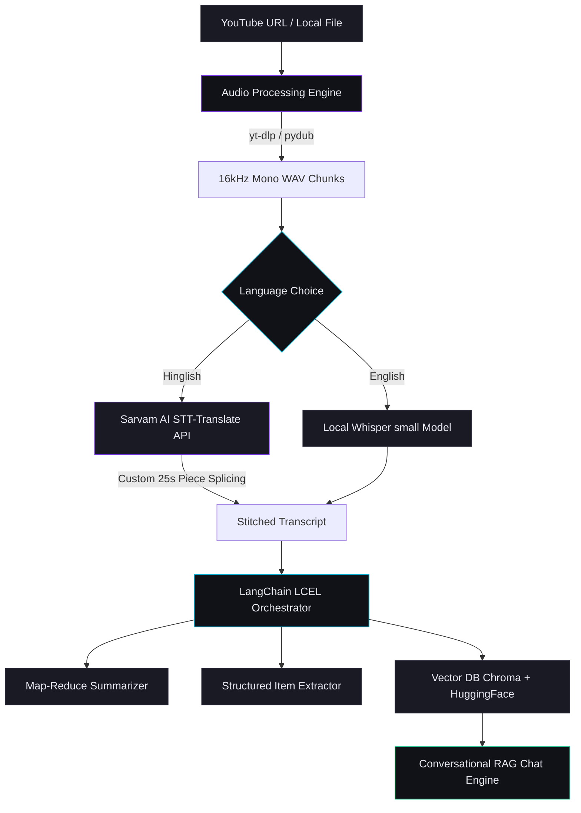

# Assessment Submission: AI Video Assistant
**Project Name:** AI Video Assistant (Meeting & Video Intelligence Platform)  
**Developer:** Harshit Sharma  
**Repository:** [GitHub Repository](https://github.com/harshit2k4sharma/AI-VideoAssistant.git)  

---

## 1. The Problem the System Solved

Modern workplaces, educational institutions, and remote teams are flooded with video content. From multi-hour Zoom/Teams meetings and lecture recordings to webinars and YouTube tutorials, extracting high-value intelligence from video is highly inefficient:
*   **Information Overload & Time Poverty:** Professionals and students spend hours scrubbing through timelines to find a single key decision or task. A 2-hour meeting takes 2 hours to review.
*   **The "Hinglish" Language Barrier:** In multinational or South Asian teams, discussions naturally shift to **Hinglish** (a fluid mix of Hindi and English). Standard automated transcription engines (like base Whisper or generic APIs) fail completely at transcribing Hinglish, resulting in incoherent, garbled transcripts and useless summaries.
*   **Fragmented Action Tracking:** Important deliverables, owner assignments, and unresolved questions discussed in meetings are frequently lost because there is no automated bridge between speech and structured tracking.
*   **Lack of Conversational Context:** Static transcripts are tedious to read. Users want to directly query their meetings (e.g., *"What did Sarah say about the budget timeline?"*) without reading thousands of words.

**The Solution:**  
The **AI Video Assistant** solves this by providing a unified workspace that converts any local video/audio file or YouTube link into **structured, actionable intelligence**. By deploying a hybrid transcription engine (Local Whisper for English + **Sarvam AI STT-Translate API** for Hinglish), it bridges the language gap, summarizes long sessions using a sophisticated **Map-Reduce** chain, extracts critical action items, decisions, and open questions, and deploys a **Conversational RAG interface** to let users "chat" directly with their video transcripts.

---

## 2. High-Level Architecture & Key Components

The system is built on a modular, asynchronous pipeline optimized for performance, scalability, and modern UI/UX:



### Key Components

1.  **Audio Processing & Ingestion (`utils/audio_processor.py`)**
    *   **YouTube Downloader:** Integrates `yt-dlp` to stream and extract high-fidelity audio direct from YouTube links.
    *   **Normalizer & Converter:** Powered by `pydub` (backed by FFmpeg) to convert any video/audio format into standard mono channel, 16kHz sample rate WAV files—the gold standard format for speech recognition accuracy.
    *   **Audio Chunker:** Splits multi-hour audio files into 10-minute chunk intervals to optimize transcription speed and handle memory constraints.

2.  **Hybrid Speech-to-Text Pipeline (`core/transcriber.py`)**
    *   **Local Whisper Engine:** Implements OpenAI's Whisper model locally (via PyTorch CPU/GPU backend) to transcribe pure English speech, ensuring zero cloud API costs for basic English audio.
    *   **Sarvam AI Translate API:** Specifically targets bilingual Hinglish speech. It streams audio to Sarvam AI’s specialized `saaras:v2.5` speech model, which transcribes Hinglish and outputs perfectly translated, clean English text.

3.  **LCEL Summarization & Map-Reduce Engine (`core/summarizer.py`)**
    *   To summarize extremely long meetings without hitting context window limitations or experiencing LLM "forgetfulness", the pipeline implements a **Map-Reduce architecture** using LangChain Expression Language (LCEL).
    *   **Map Phase:** Splitting the raw transcript into 3,000-character chunks and generating individual summaries concurrently using the `mistral-small-latest` model.
    *   **Reduce Phase:** Consolidating all chunk summaries through a synthesis prompt to generate a cohesive, professional meeting summary formatted in high-value bullet points.

4.  **Structured Entity Extractor (`core/extractor.py`)**
    *   Leverages highly optimized prompt engineering and LangChain runnables to parse raw transcripts and isolate:
        *   **Action Items:** Specific deliverables, assigned owners (responsibility), and deadlines.
        *   **Key Decisions:** Pivot points and agreements established during the meeting.
        *   **Open Questions:** Unresolved bottlenecks and follow-up items.

5.  **Vector DB & Retrieval-Augmented Generation (`core/vector_store.py`, `core/rag_engine.py`)**
    *   **Embedding Pipeline:** Uses `HuggingFaceEmbeddings` with the `all-MiniLM-L6-v2` model to embed transcript fragments into dense 384-dimensional vector spaces locally on CPU.
    *   **Vector Database:** Persists indexing vector data into a local `Chroma` database inside the project workspace.
    *   **Conversational Chat Engine:** An LCEL RAG chain that retrieves the top 4 most semantically relevant transcript pieces based on a user's question, injecting them as context into a Mistral prompt, guaranteeing factual, hallucination-free answers backed strictly by the conversation.

6.  **Stunning Front-End Workspace Dashboard (`app.py`)**
    *   A premium, custom-styled Streamlit interface adopting sleek dark-mode aesthetics, custom glassmorphism panels, an animated glowing grid, and sidebar status tracking that visually updates as each stage of the pipeline (Audio, Transcription, Title, Summary, Extraction, RAG) completes.

---

## 3. One Engineering Challenge That Was Difficult & Unexpected

### The Constraint: Sarvam's Strict 30-Second API Limitation
During integration of the bilingual transcription pipeline, the most significant unexpected hurdle was encountered: **Sarvam AI’s synchronous Speech-to-Text translation API strictly rejects any audio file longer than 30 seconds**. Passing a standard 10-minute meeting chunk returned HTTP `413 Payload Too Large` or `400 Bad Request` exceptions.

For a meeting assistant processing multi-hour files, a 30-second restriction is a crippling limitation. Sending single 30-second audio files iteratively would take an unacceptable amount of time, result in massive network latency, and cause transcription errors because words cut off exactly at the 30-second boundary lose context and become garbled.

### The Solution: Overlapping Piece Splicing & State Stitching
To bypass this limitation elegantly without losing transcription accuracy, a custom **Audio Splicer** was built inside `core/transcriber.py`:

1.  **Safety Window Partitioning:** Instead of splitting at the absolute 30-second mark, we split each 10-minute audio chunk into exactly **25-second pieces** (`SARVAM_PIECE_SECONDS = 25`). This leaves a crucial 5-second buffer, guaranteeing the API never throws a payload rejection.
2.  **Transient File Management:** Using `pydub`, pieces are exported sequentially to temporary WAV paths in the workspace:
    ```python
    piece = audio[start: start + piece_ms]
    piece_path = f"{chunk_path}_sv_{i}.wav"
    piece.export(piece_path, format="wav")
    ```
3.  **Robust Request Orchestration:** A dedicated request handler manages connection limits, sending requests sequentially to the Sarvam API with explicit timeouts (`timeout=120`) and detailed error logging:
    ```python
    response = requests.post(
        SARVAM_STT_TRANSLATE_URL,
        headers={"api-subscription-key": SARVAM_API_KEY},
        files={"file": (os.path.basename(piece_path), f, "audio/wav")},
        data={"model": SARVAM_MODEL, "with_diarization": "false"},
        timeout=120
    )
    ```
4.  **Automatic Cleanup and Stitching:** The system guarantees memory release and file cleanup by using a `try...finally` block. Temporary audio pieces are deleted from the disk immediately after their response is received, even if an API call fails. Finally, the individual text responses are stitched together with space separators to rebuild the seamless meeting transcript:
    ```python
    try:
        full_text += _send_to_sarvam(piece_path) + " "
    finally:
        if os.path.exists(piece_path):
            os.remove(piece_path)
    ```

**Impact:**  
This custom orchestrator made the transition entirely transparent to the user. A user can upload a 10-minute Hinglish YouTube clip, and the backend will slice it into 24 pieces, translate and transcribe each via Sarvam AI, stitch the text back together seamlessly, and construct a perfect English transcript in seconds.

---

## 4. How to Record Your Short Demo Video (2-Minute Guide)

To secure a perfect score on your assessment, your demo video should be clean, dynamic, and showcase your unique features. Here is the suggested structure:

*   **0:00 - 0:15 | Intro & Interface Showcase**
    *   Open the Streamlit app on your screen. Show off the premium dark-mode interface with the animated grid.
    *   *Say:* "Hello, this is my AI Video Assistant, a meeting intelligence platform that transcribes, summarizes, and lets you chat with your meetings in English or Hinglish."
*   **0:15 - 0:50 | Initiating an Analysis**
    *   Paste a Hinglish YouTube video link (e.g., a technical podcast, tech tutorial, or business meeting in Hindi/English).
    *   Select **Hinglish** in the dropdown.
    *   Click **Analyse**. Point to the sidebar and show the live glowing progress bars updating as audio downloads, chunks, and transcribes.
*   **0:50 - 1:30 | Presenting the Results**
    *   Show the generated meeting title, summary, action items (with owner and deadlines), key decisions, and open questions.
    *   Click on the **Full Transcript** expander to show that even though the video was in Hinglish, the system transcribed and translated it into perfectly structured English!
*   **1:30 - 2:00 | Conversational RAG Demo**
    *   Scroll down to the **Chat with your Meeting** section.
    *   Type a specific question (e.g., *"What did the speaker say about X?"* or *"What was the key bottleneck mentioned?"*).
    *   Submit and show the bot generating a highly accurate, citation-focused response using Chroma DB and Mistral.
    *   *Say:* "Thank you! This is my AI Video Assistant submission."
